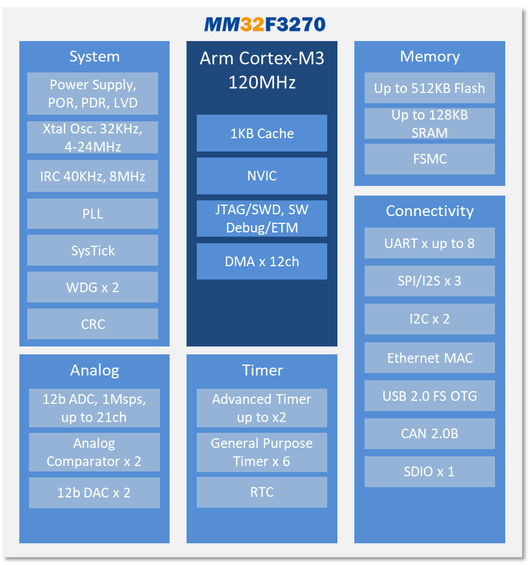

# [MM32F3270](https://github.com/SoCXin/MM32F3270)

* [mindmotion](http://www.mindmotion.com.cn/)：[Cortex-M3](https://github.com/SoCXin/Cortex)
* [L4R4](https://github.com/SoCXin/Level) ：120 MHz  * 1.25 DMIPS/MHz

## [简介](https://github.com/SoCXin/MM32F3270/wiki)

[MM32F3270](https://github.com/SoCXin/MM32F3270)基于Arm Cortex-M3 内核，适用于要求高集成度的高性能控制领域,支持工业级（-40℃ ~ 85℃）和扩展工业级（-40℃ ~ 105℃）工作温度。

#### 关键特性

* 512KB Flash + 128KB SRAM
* 8xUART、3xSPI 、2xI2C
* 与MM32F103引脚兼容

#### 封装规格

* LQFP48/64/100/144
* QFN40

### [资源收录](https://github.com/SoCXin)

* [参考文档](docs/)
* [参考资源](src/)
* [参考工程](project/)

### [选型建议](https://github.com/SoCXin)

[MM32F3270](https://github.com/SoCXin/MM32F3270) 可作为 [MM32F103](https://github.com/SoCXin/MM32F103) 替换选项，适用于多串口场景，相似规格可选项较多。

### [探索芯世界 www.SoC.xin](http://www.SoC.Xin)
